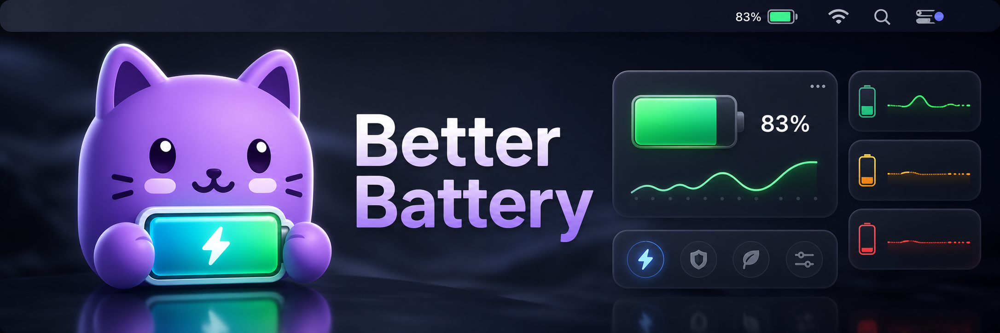

# Better Battery

Better Battery is a lightweight macOS menu-bar app for watching battery charge, health, drain speed, screen-awake time, and low-battery alerts without opening System Settings.

It is built with SwiftUI and AppKit, ships as a small menu-bar utility, and keeps the interface compact enough for daily use.

## Features

- Menu-bar battery indicator with percentage and charging state.
- Popover dashboard with charge status, estimated time, current power, and recent drain.
- Battery health details: cycles, capacity, voltage, amperage, temperature, and health percentage where macOS exposes them.
- Low-battery notifications with configurable thresholds and sound.
- Russian and English UI language options.
- Custom color roles for healthy, balanced, low, critical, and charging states.
- Friendly mascot states for charge levels and charging.

## Requirements

- macOS 13 Ventura or newer.
- Apple Silicon or Intel Mac supported by the SwiftPM build target.

## Install

1. Download the latest `Better-Battery-v0.1.N-macOS.dmg` from GitHub Releases.
2. Open the DMG.
3. Drag `Better Battery.app` to Applications.
4. Launch the app from Applications.

The v0.1 DMG is unsigned and not notarized. On first launch, macOS Gatekeeper may block it. Open System Settings, go to Privacy & Security, and allow Better Battery, or right-click the app and choose Open.

## Build Locally

```bash
swift build --disable-sandbox
swift test --disable-sandbox
```

Tests require a full Xcode toolchain with XCTest available. Command Line Tools alone may build the app but fail to compile the test target.

Create a release-style app bundle and DMG:

```bash
./script/build_app.sh 0.1.0 release
```

Run a local debug app bundle:

```bash
./script/build_and_run.sh
```

## Release Flow

Every push to `main` runs GitHub Actions, builds and tests the app on macOS, calculates the next `v0.1.N` tag, creates an unsigned DMG, and publishes a GitHub Release with the DMG attached.

## License

Better Battery is released under the MIT License.
